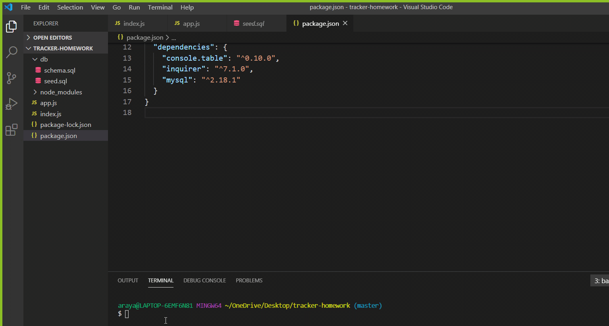

###Employee Tracker

By Araya Nawrath 

###Description
Manage your employee database using NodeJS Inquirer. Allows for all CRUD operations (Create, Read, Update, Delete).

###Installation
Git clone this repo and add a config file in the /utils folder to add your database connection details. Use either the config_template.json file (and rename it) or copy the snippet below.

{
    "user": "root",
    "password": "",
    "host": "localhost",
    "database": "employee_db"
}

###Usage
Run npm install to grab mysql and inquirer.

###Run node index.js. or npm start. 

###How do you deliver this? Here are some guidelines:

###Use the MySQL NPM package to connect to your MySQL database and perform queries.

Use InquirerJs NPM package to interact with the user via the command-line.

Use console.table to print MySQL rows to the console. There is a built-in version of console.table, but the NPM package formats the data a little better for our purposes.

You may wish to have a separate file containing functions for performing specific SQL queries you'll need to use. Could a constructor function or a class be helpful for organizing these?

You will need to perform a variety of SQL JOINS to complete this assignment, and it's recommended you review the week's activities if you need a refresher on this.